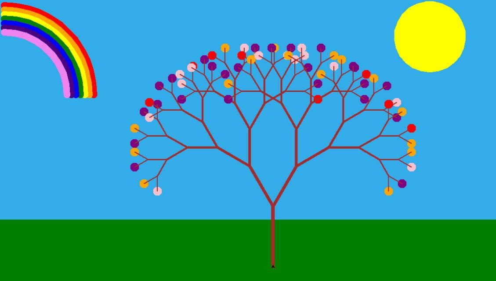

# My first Computer Art Project



``` python 
import turtle

p = turtle.Turtle()
p.setpos(-200,-200)

def tree(l,a,s):
    p.clear()
    p.write(l, font=("Arial", 24, "normal"))
    if l > 30:
        turtle.pensize(s)
        turtle.forward(l)
        turtle.left(a)
        tree(l*0.7,a, s-1)
        turtle.right(2*a)
        tree(l*0.7,a, s-1)
        turtle.left(a)
        turtle.backward(l)
    else:
        color = turtle.pencolor()
        turtle.pencolor("green")
        for i in range(4):
            turtle.forward(l)
            turtle.right(90)
        turtle.pencolor(color)

    turtle.update()

turtle.penup()
turtle.setheading(90)
turtle.speed(0)
turtle.setpos(0,-300)
turtle.pendown()
tree(200, 25, 8)

turtle.mainloop()
```

